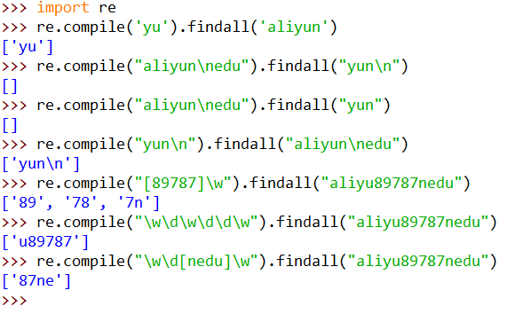

# 正则表达式

[TOC]

## 基础1

全局匹配函数使用格式		re.compile(正则表达式).findall(源字符串)


普通字符		正常匹配

\n					匹配换行符

\t					匹配制表符

\w					匹配字母、数字、下划线

\W					匹配除字母、数字、下划线

\d					匹配十进制数字

\D					匹配除十进制数字

\s					匹配空白字符

\S					匹配除空白字符

[ab89x]			原子表，匹配ab89x中的任意一个

[^ab89x]			原子表，匹配除ab89x意外的任意一个字符

## 实例1

源字符串："aliyunedu"

正则表达式："yu"

匹配结果			yu

---

源字符串：

"aliyun

edu"

正则表达式："yun\n"

匹配结果：	yun\n

---

源字符串："aliyu89787nedu"

正则表达式："\w\d\w\d\d\w"

匹配结果		u89787

---



---

## 基础2

.		匹配除换行外任意**一个**字符

^		匹配开始位置

$		匹配结束位置

\*		前一个字符出现0\1\多次

？		前一个字符出现0\1次

\+		前一个字符出现1\多次

{n}		前一个字符恰好出现n次

{n,}		前一个字符至少n次

{n,m}	前一个字符至少n次，至多m次

|		模式选择符号-或

()		模式单元，通俗来说就是：想提取出什么内容，就在正则中用小括号将其括起来

---

## 实例2

**源字符串："aliyunnnnji87362387aoyubaidu"**

正则表达式："ali..."

匹配结果：	aliyun

---

正则表达式："^li..."

匹配结果：	None

---

正则表达式："^ali..."

匹配结果：aliyun

---

正则表达式："bai..$"

匹配结果：baidu

---

正则表达式："ali.*"

匹配结果：aliyunnnnji87362387aoyubaidu

Tips:默认贪婪，即默认尽可能多地进行匹配

---

正则表达式："aliyun+"

匹配结果：aliyunnnn

---

正则表达式："aliyun?"

匹配结果：aliyun

---

正则表达式："yun{1,2}"

匹配结果：yunn

---

正则表达式："^al(i..)"

匹配结果：iyu


## 基础3

贪婪模式：尽可能多地匹配

懒惰模式：金肯呢过少的匹配，精准模式

默认贪婪模式

如出现如下组合，则代表为懒惰模式：

*?

+?


## 实例3

**源字符串："poythonyhjskjsa"**

---

正则表达式："p.*y"

匹配结果：poythony

Tips：默认贪婪

---

正则表达式："p.*?y"

匹配结果：['poy','phony']

Tips：懒惰模式，精准匹配

---

## 基础4

模式修正符：再不改变正则表达式的情况下通过模式修正符使匹配结果发生更改


re.S		让'.'也可以匹配多行

re.I		让匹配时忽略大写（ i 的大写）


## 实例4

源字符串：string="Python"

正则表达式："pyt"

---

匹配方式：re.compile("pyt").findall("Python")

匹配结果：[]

---

匹配方式：re.compile("pyt",re.I).findall("Python")

匹配结果：Pyt

---

源字符串：string="""我是阿里云大学

欢迎来学习

Python网络爬虫课程

"""

正则表达式：pat="阿里.*?Python"

匹配方式：re.compile(pat).findall(string)

匹配结果：[]

匹配方式：re.compile(pat,re.S).findall(string)

匹配结果：['阿里云大学\n欢迎来学习\nPython']


---

## 其他——XPath

其他信息筛选工具：XPath表达式、BeautifulSoup


XPath表达式

/													逐层提取

text()											提取标签下面的文本

//标签名\*\*									提取所有名为\*\*的标签

//标签名[@属性='属性值XX']			提取属性为XX的标签

@属性名										代表取某个属性值

---

源码

```html
<html>
<head>
    <title>
        主页
    </title>
	</head>
<body>
    <p>abc</p>
    <p>bbbvb</p>
    <a href="//qd.alibaba.com/go/v/pcdetail" target="_top">安全推荐</a>
    <a href="//qd.alibaba.com/go/v/pcdetail" target="_top">安全推荐2</a>
    <div class="J_AsyncDC" data-type="dr">
        <div id="official=remind">
            明月几时有
        </div>
    </div>
</body>
```


分析以下XPath表达式提取的内容：

/html/head/title/text()					提取标题

//p/text()											提取所有的p标签下的文本内容

//a														提取所有的a标签

//div[@id='official-remind']/text()	提取所有的属性id值为'official-remind'的div标签下文本内容

//a/@href											提取所有的a标签的href属性值


实例

提取标题：/html/head/title/text()

提取所有的div标签：//div

提取div中\<div class="tools"\>标签的内容：//div[@class='tools']/text()