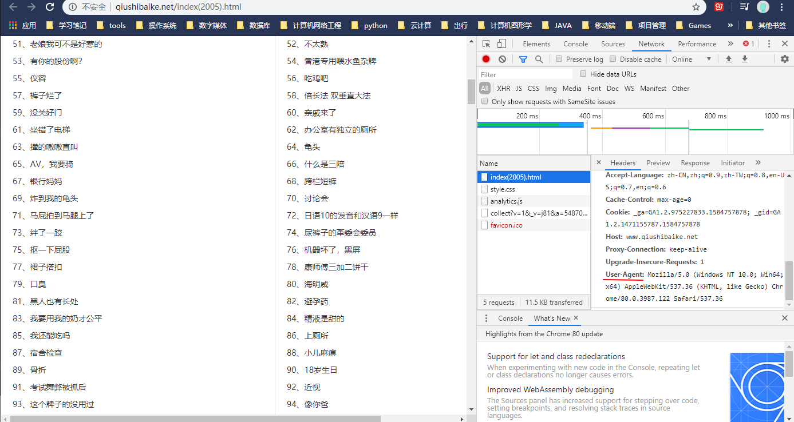
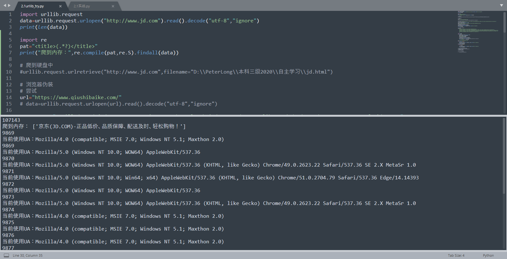
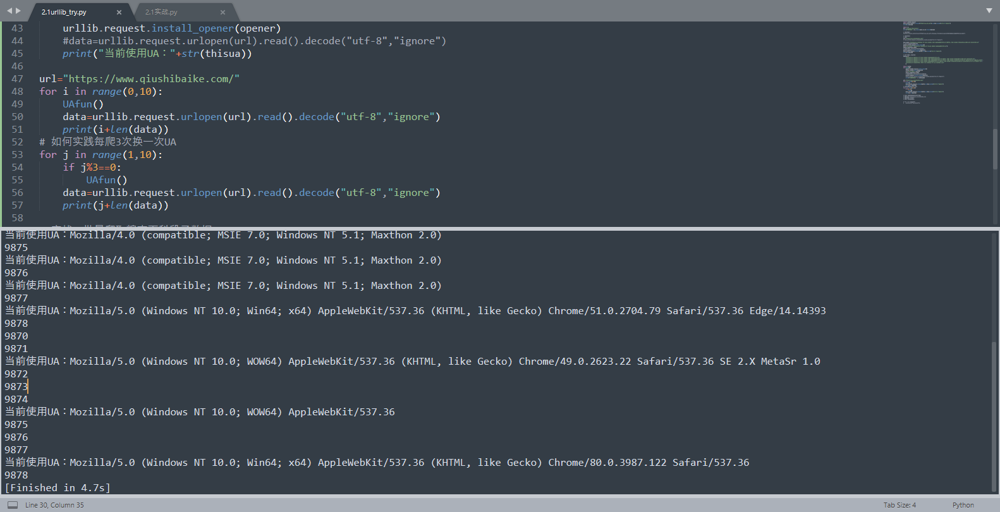
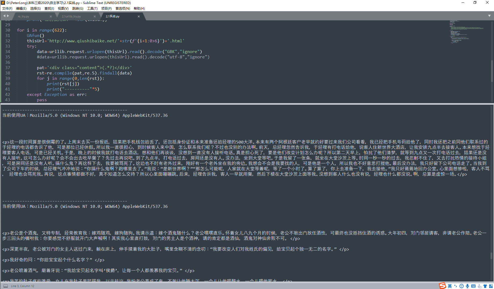

# 课时2 Urllib爬虫（WebCrawler）项目编写实战

[TOC]


## 课程地址

https://edu.aliyun.com/course/1994?spm=5176.10731542.0.0.35b342c4doXI1Q

## Urllib模块简介

一个自带的可以用于编写爬虫的常用模块


## Urllib基础使用

### 1. 导入模块

```python
import urllib.request
```

### 2. 简单爬取

```python
import urllib.request
data=urllib.request.urlopen("http://www.jd.com").read().decode("utf-8","ignore")
print(len(data))
```


### 3. 爬到内存

```python
import re
pat="<title>(.*?)</title>"
print("爬到内存：",re.compile(pat,re.S).findall(data))
```


### 4. 爬到硬盘

```python
# 爬到硬盘中
urllib.request.urlretrieve("http://www.jd.com",filename="D:\\PeterLong\\本科三级2020\\AliyunWebCrawlerCourse\\课时2：Urllib爬虫项目编写实战\\jd.html")
```

​	路径可用 '/'，如果用 '\\\\'（这里打了4个'\\'），则必须是两根，因为'\\'转义，必须转义其“转义”


### 5. 浏览器伪装

查看浏览器代理：Chrome（或者其他有此功能浏览器）打开网址，F12开发者模式，点击Network，刷新网页，点击网页html文件，下滑即可看到User-Agent（图中右侧）。想要多个代理可以切换不同浏览器（或者不同浏览器版本、不同主机？）查看



```python
# 浏览器伪装
# 尝试
url="https://www.qiushibaike.com/"
# data=urllib.request.urlopen(url).read().decode("utf-8","ignore")

User_Agent="Mozilla/5.0 (Windows NT 10.0; Win64; x64) AppleWebKit/537.36 (KHTML, like Gecko) Chrome/80.0.3987.122 Safari/537.36"
# opener添加高级设置的对象
opener=urllib.request.build_opener()
UA=("User-Agent","Mozilla/5.0 (Windows NT 10.0; WOW64) AppleWebKit/537.36")
opener.addheaders=[UA]
# 安装opener为全局，让urlopen也可以实现伪装
urllib.request.install_opener(opener)
data=urllib.request.urlopen(url).read().decode("utf-8","ignore")
print(len(data))
```

​	opener:

​	urlopen是一个传创建好的opener对象，不支持代理、cookie等其他HTTP/GTTPS高级功能。支持这些功能的方法有（https://www.cnblogs.com/derek1184405959/p/8449159.html）：

　　1.使用相关的Handler处理器来创建特定功能的处理器对象；

　　2.然后通过urllib2.build_opener()方法使用这些处理器对象，创建自定义opener对象；

　　3.使用自定义的opener对象，调用open()方法发送请求。

​	

### 6. 用户代理池

代理池即多个代理，避免同一代理连续多次访问同一网站遭到反爬阻挡。

代码：

```python
# 用户代理池，伪装升级
uapools=[
	"Mozilla/5.0 (Windows NT 10.0; WOW64) AppleWebKit/537.36",
	"Mozilla/5.0 (Windows NT 10.0; Win64; x64) AppleWebKit/537.36 (KHTML, like Gecko) Chrome/80.0.3987.122 Safari/537.36",
	"Mozilla/5.0 (Windows NT 10.0; Win64; x64) AppleWebKit/537.36 (KHTML, like Gecko) Chrome/51.0.2704.79 Safari/537.36 Edge/14.14393",
	"Mozilla/5.0 (Windows NT 10.0; WOW64) AppleWebKit/537.36 (KHTML, like Gecko) Chrome/49.0.2623.22 Safari/537.36 SE 2.X MetaSr 1.0",
	"Mozilla/4.0 (compatible; MSIE 7.0; Windows NT 5.1; Maxthon 2.0)"
	]

import random
def UAfun():
	opener=urllib.request.build_opener()
	thisua=random.choice(uapools)
	ua=("User-Agent",thisua)
	opener.addheaders=[UA]
	# 安装为全局，让urlopen也可以实现伪装
	urllib.request.install_opener(opener)
	#data=urllib.request.urlopen(url).read().decode("utf-8","ignore")
	print("当前使用UA："+str(thisua))

url="https://www.qiushibaike.com/"
for i in range(0,10):
	UAfun()
	data=urllib.request.urlopen(url).read().decode("utf-8","ignore")
	print(i+len(data))
# 如何实践每爬3次换一次UA
for j in range(1,10):
	if j%3==0:
		UAfun()
	data=urllib.request.urlopen(url).read().decode("utf-8","ignore")
	print(j+len(data))
```

运行结果：






## 实战

实战目标：批量爬取糗事百科段子数据

目标站点：https://www.qiushibaike.com

目标数据：热门段子

要求：实现自动翻页


**分析**

（教程中目标网址变化，另外找了一个）

http://www.qiushibaike.net/

- 爬取什么数据

查看页面源代码，Ctrl+F查找相同的标签和属性

```html
<h1><a href="index(2005).html" target="_blank">糗事百科精选爆笑段子(2005年)</a><br />你的领带</h1>
<div class="content">

    <p>那次的尴尬我真的不想讲出来，现在想起来还不自在。我们办公室人员中午一般不回家，有一次我吃完午饭，趴在办公桌上休息，突然感到有点内急，就急忙去了WC，回来后经过一女同事办公桌，她看见我进来，突然绯红，似笑非笑。好在我们关系还不错，铁哥们那种，我一脸迷惑的样子问她有什么事吗，她不自然地对我说，“你的领带，”我低头一看，天呢！裤子前拉链没拉完全，衬褂从那里露出来一点，我尴尬极了！</p>

</div>
```

​	可知若要爬取段子，相应正则表达式为：

​	pat= '\<div class=\"content\"\>(.*?)\<div\>'

​	有的段子有多个\<p\>\</p\>，去掉的话可能用到 \[^xxx\]，但暂时不知道怎么写，暂且保留


- 翻页

点击不同页面查看网址变化

http://www.qiushibaike.net/000001.html

http://www.qiushibaike.net/000002.html

观察到数字变化

在url中加入变化即可

```python
for i in range(622):
	thisUrl='http://www.qiushibaike.net/'+str(f'{i+1:0>6}')+'.html'
```

（~~从网站目录看出有622条~~）


因为网址不同，测试发现我的没有那个报错，但是有乱码，尝试改成GBK就好了。

代码：

```python
# 实战：批量爬取糗事百科段子数据
# 目标站点：https://www.qiushibaike.com
# 目标数据：热门段子
# 要求：实现自动翻页

import urllib.request
import re
import random
import time

# 用户代理池，伪装升级
uapools=[
	"Mozilla/5.0 (Windows NT 10.0; WOW64) AppleWebKit/537.36",
	"Mozilla/5.0 (Windows NT 10.0; Win64; x64) AppleWebKit/537.36 (KHTML, like Gecko) Chrome/80.0.3987.122 Safari/537.36",
	"Mozilla/5.0 (Windows NT 10.0; Win64; x64) AppleWebKit/537.36 (KHTML, like Gecko) Chrome/51.0.2704.79 Safari/537.36 Edge/14.14393",
	"Mozilla/5.0 (Windows NT 10.0; WOW64) AppleWebKit/537.36 (KHTML, like Gecko) Chrome/49.0.2623.22 Safari/537.36 SE 2.X MetaSr 1.0",
	"Mozilla/4.0 (compatible; MSIE 7.0; Windows NT 5.1; Maxthon 2.0)"
	]

def UAfun():
	opener=urllib.request.build_opener()
	thisUA=random.choice(uapools)
	UA=("User-Agent",thisUA)
	opener.addheaders=[UA]
	# 安装为全局，让urlopen也可以实现伪装
	urllib.request.install_opener(opener)
	#data=urllib.request.urlopen(url).read().decode("utf-8","ignore")
	print("当前使用UA："+str(thisUA))

for i in range(622):
	UAfun()
	thisUrl='http://www.qiushibaike.net/'+str(f'{i+1:0>6}')+'.html'
	try:
		data=urllib.request.urlopen(thisUrl).read().decode("GBK","ignore")
		#data=urllib.request.urlopen(thisUrl).read().decode("utf-8","ignore")
		
		pat='<div class="content">(.*?)</div>'
		rst=re.compile(pat,re.S).findall(data)
		for j in range(0,len(rst)):
			print(rst[j])
			print("----------"*5)
	except Exception as err:
		pass
```

运行结果



