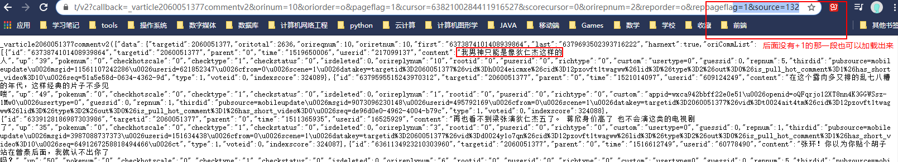

# 课时3：抓包分析技术精讲

韦玮老师 课程地址

https://edu.aliyun.com/lesson_1994_17792?spm=5176.10731542.0.0.632742c4KvAxpo#_17792


## Fiddler安装与使用

​	Fiddler，一款安装使用方便的抓包工具，类似浏览器F12，但是比其方便，功能更全

​	其默认IP及端口为：127.0.0.1			8888

​	官方地址：https://www.telerik.com/fiddler

​	下载安装之后，选用一个浏览器用来专门使得其所有访问经过Fiddler（这里我自己下载了一个Firefox）

​	浏览器配置（选项-网络设置）：


​	

**Fiddler介绍：**


到此可以访问基本HTTP协议网址，但是不能访问HTTPS协议网址，另需设置。


## 使用Fiddler抓取HTTPS协议的网页

Fiddler导出证书->证书安装到浏览器中

1. ​	Fiddler---Tools---Fiddler Options---HTTPS----全部勾选（一路确定）---Actions---Export Root Certificate to Desktop---ok
2. ​	浏览器---选项---证书/查看证书---证书颁发机构---导入---选中刚才的桌面证书导入
3. ​	刷新淘宝网页或者关掉浏览器Fiddler重新访问测试。

参考博文：https://weibo.com/ttarticle/p/show?id=2309404103263770292716


​	

## 使用抓包分析获取腾讯视频评论数据


### 分析

 （~~本来担心我的Fiddler老感觉出来的结果和韦玮老师的不一样，结果发现可以用~~）

利用Fiddler

打开网页，下滑到评论区，看到有“查看更多评论”按钮，先clear，再点击网页按钮，评论讲道理应该是在js里面找到第一个js就是（我这里的js和老师视频的不一样，找到就行，第一个js就对了），看到TextView里面有浏览器里面的看到的评论文字（老师视频里是\u6211等字样，\u表示Unicode中文解码，python里面可用u'\u6211\u...\u...'尝试查看评论是否正确）


Fiddler中右键点击那个js，copy-just url，保存下来

https://video.coral.qq.com/varticle/2060051377/comment/v2?callback=_varticle2060051377commentv2&orinum=10&oriorder=o&pageflag=1&cursor=6361537946612933091&scorecursor=0&orirepnum=2&reporder=o&reppageflag=1&source=132&_=1584847274299

接着网页下滑到另一个“查看更多评论”按钮，记住Fiddler中最后的序号（等会儿新的一页就从这里开始，Fiddler此时应该暂时不刷新了），点击按钮，从刚才的序号开始找前面的js，和刚才一样

https://video.coral.qq.com/varticle/2060051377/comment/v2?callback=_varticle2060051377commentv2&orinum=10&oriorder=o&pageflag=1&cursor=6382100284411916527&scorecursor=0&orirepnum=2&reporder=o&reppageflag=1&source=132&_=1584847274300


**观察变化的部分**

——cursor，变化无规律

——source，+1，但是尝试发现，没有那一段也可以进去

https://video.coral.qq.com/varticle/2060051377/comment/v2?callback=_varticle2060051377commentv2&orinum=10&oriorder=o&pageflag=1&cursor=6382100284411916527&scorecursor=0&orirepnum=2&reporder=o&reppageflag=1&source=132




那么只能看看cursor数值哪里来的

在浏览器或者Fiddler里面都可以查看，找第二页没看到这个6382100284411916527，找第一页就发现了


'last'字段就是下一段迭代的数据入口，且整个textview里面，有多个content都是评论内容本身，last只有这一个


测试验证：找出第二页中的’last‘，输入查看——'last':6379693502393716222

https://video.coral.qq.com/varticle/2060051377/comment/v2?callback=_varticle2060051377commentv2&orinum=10&oriorder=o&pageflag=1&cursor=6379693502393716222&scorecursor=0&orirepnum=2&reporder=o&reppageflag=1&source=132


### 开始爬虫啦！

```python
import urllib.request
import re

# cursorid，这是第一页的cursor而不是last
cid='6361537946612933091'
# 分析中最后一个+1的无关紧要，url中直接去掉dawdawdaAWDAdawdAwDasdadAwdawDaWdAwda

for i in range (0,100):
	print('第'+str(i+1)+'页评论数据')
	# 更新url
	url='https://video.coral.qq.com/varticle/2060051377/comment/v2?callback=_varticle2060051377commentv2&orinum=10&oriorder=o&pageflag=1&cursor='+str(cid)+'&scorecursor=0&orirepnum=2&reporder=o&reppageflag=1&source=132'

	data=urllib.request.urlopen(url).read().decode('utf-8','ignore')
	# 匹配content后面的值，即双引号内文本，注意加双引号
	pat1='"content":"(.*?)"'
	comment=re.compile(pat1,re.S).findall(data)
	# comment是一个list，可以分开输出
	for item in comment:
		print(str(item))
		# 如果输出为\u6211等字符编码，改为如下方式
		# print(eval('u"'+str(item)+'"'))
		print("------------"*3)

	# 更新cid，下一个数据入口
	pat2='"last":"(.*?)"'
	cid=re.compile(pat2,re.S).findall(data)[0]
```


运行效果（每一页都有一定延迟）：


人生若只如初见，何事秋风悲画扇~


仰天大笑出门去，我辈岂是蓬蒿人~

