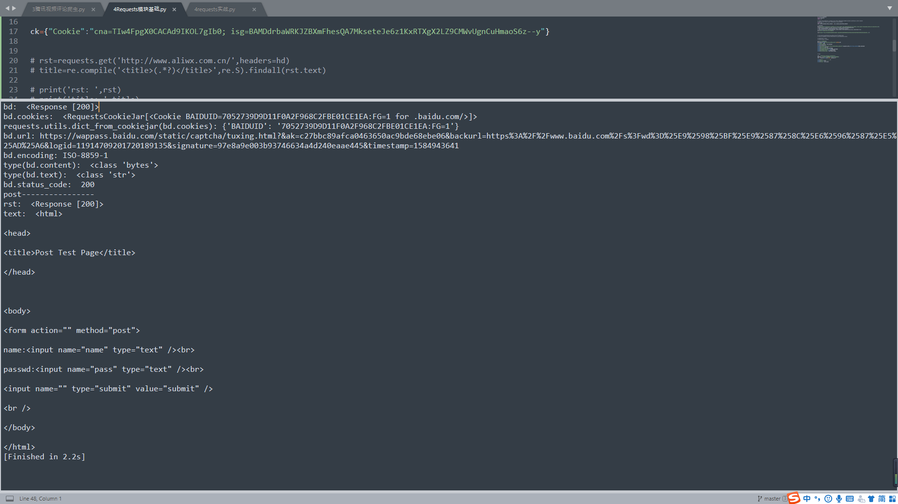
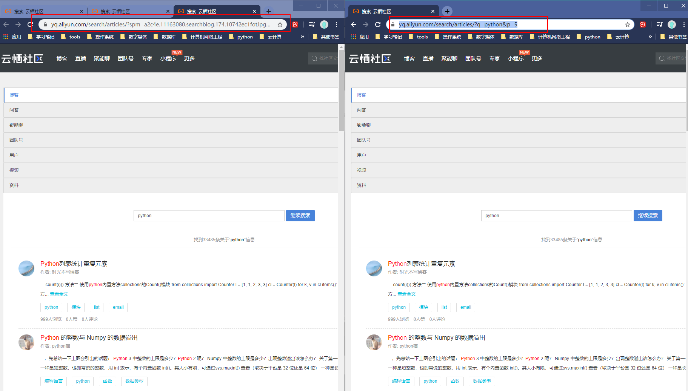
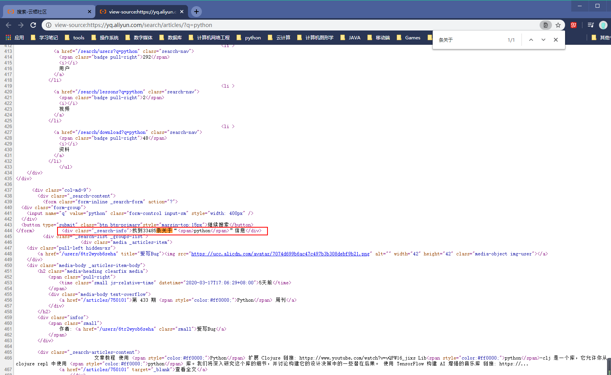
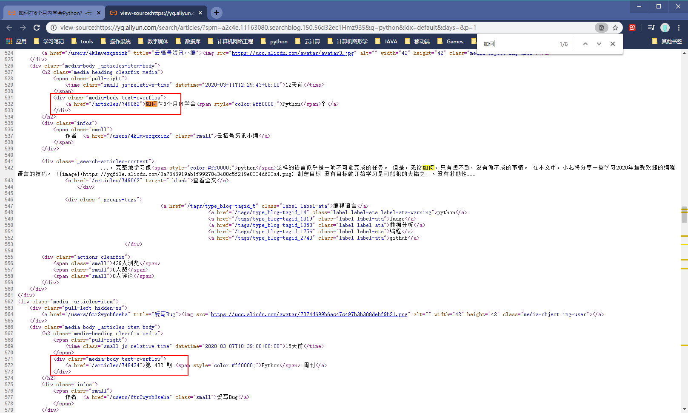
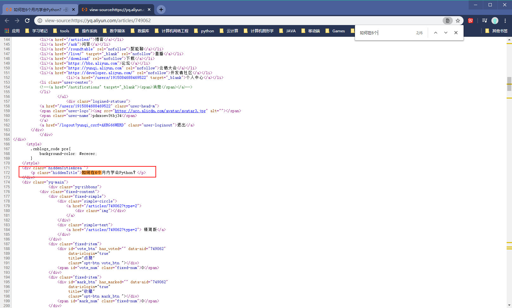
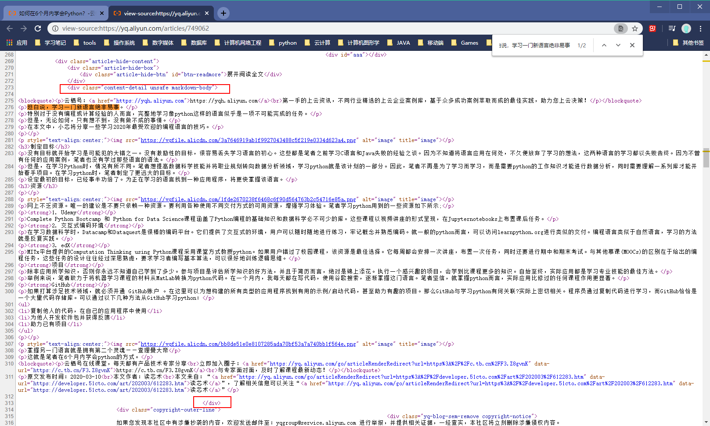
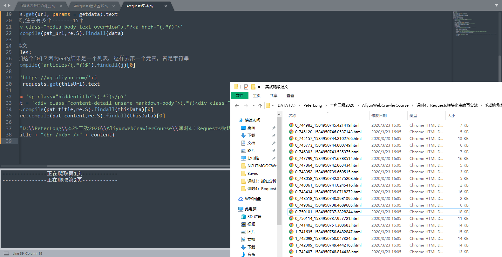

# 课时 4 Requests模块爬虫编写实战

地址：https://edu.aliyun.com/lesson_1994_17793?spm=5176.8764728.0.0.7c8842c4BbDcyu#_17793

韦玮老师简介：阿里云云栖社区专家，企业家，资深IT领域专家/讲师/作家，畅销书《精通Python网络爬虫作者》

---

## Request模块简介与基础

​	除了urllib，还可以选择其他非常实用的模块，如Requests模块、Scrapy框架。具体技术手段可自行选择。爬虫难点不在于技术手段本身，而在于网页分析与反爬攻克。

​	requests模块需要自行安装：pip install requests

### 简介

请求

​	请求方式：get、post、put

​	使用时直接：requests.get()

​	

​	通过参数控制模拟浏览器、代理、cookies等

参数：

​	params：一般放get请求的参数等，字典存储，

​	headers：添加头信息，伪装浏览器，字典存储

​	proxies：代理ip，字典存储，key为协议名，value为代理ip

​	cookies：使用cookies

​	data：通常用于post请求中，存储post请求中发过去的数据

​	

属性：

​	text：一般代表对应请求的响应数据

​	content：响应数据，B类型——二进制类型流数据

​	encoding：当前网页编码

​	cookies：响应cookies

​	url：当前请求的网页url

​	status_code：状态码

​	

学习前期尽量找不太敏感的网址，没有反爬机制


### 代码笔记：

```python
# 4 Requests模块基础
import requests
import re

# urllib.error.URLError: <urlopen error [SSL: CERTIFICATE_VERIFY_FAILED] certificate verify failed:
# unable to get local issuer certificate (_ssl.c:1045)>
import ssl
ssl._create_default_https_context = ssl._create_unverified_context

# 伪装浏览器
hd={"User-Agent":"Mozilla/5.0 (Windows NT 10.0; Win64; x64) AppleWebKit/537.36 (KHTML, like Gecko) Chrome/80.0.3987.122 Safari/537.36"}
# 需要开Fiddler才能使用这个ip+端口，因为fiddler才是代理，没有真正的代理的话最好关闭掉
# 检查一下电脑的网络设置，有没有正在使用这个端口，有的话需要关掉，避免占用
# 发现打开Fiddler之后，系统会自动设置代理，出现SSL等报错，解决之前建议把Fiddler关掉，并跳过代理这一部分
px={"http":"http://127.0.0.1:8888"}   

ck={"Cookie":"cna=TIw4FpgX0CACAd9IKOL7gIb0; isg=BAMDdrbaWRKJZBXmFhesQA7MkseteJe6z1KxRTXgX2LZ9CMWvUgnCuHmaoS6z--y"}


# rst=requests.get('http://www.aliwx.com.cn/',headers=hd)
# title=re.compile('<title>(.*?)</title>',re.S).findall(rst.text)

# print('rst: ',rst)
# print('title: ',title)

pr={"wd":"阿里文学"}
bd=requests.get("http://www.baidu.com/s",params=pr)
print('bd: ',bd)
print('bd.cookies: ',bd.cookies)
# cookies转换成字典
print('requests.utils.dict_from_cookiejar(bd.cookies):',requests.utils.dict_from_cookiejar(bd.cookies))
print('bd.url:',bd.url)
print('bd.encoding:',bd.encoding)
print('type(bd.content): ',type(bd.content))
print('type(bd.text): ',type(bd.text))
print('bd.status_code: ',bd.status_code)


# post

url = 'http://www.iqianyue.com/mypost/'
postdata = {"name":"测试账号","pass":"测试密码"}
rst = requests.post(url,data =postdata )

print('post----------------')
print('rst: ',rst)
print('text: ',rst.text)

```


学到这里发现了很多bug

Fiddler：502问题，修改host文件也没用

添加代理时老是SSL报错，网上的取消SSL全局验证也没什么用——看到后面果然是要将其关掉，但是他前面没关也没报错就很尬


效果：




cookies转成字典

```python
requests.utils.dict_from_cookiejar(result.cookies)
```


---

## 使用Requests实现云栖社区博文爬虫实战


目标站点：云栖社区（http://yq.aliyun.com）

需求数据：指定关键词的博文数据

要求：自动翻页并下载到本地


### 分析

打开网页，搜索python

搜索结果网址：https://yq.aliyun.com/search?q=python&type=ARTICLE

此为首页，点击第三页、其他页试试

3：https://yq.aliyun.com/search/articles/?spm=a2c4e.11163080.searchblog.167.44fb2ec1vjoB2k&q=python&idx=default&days=&p=3

5：https://yq.aliyun.com/search/articles/?spm=a2c4e.11163080.searchblog.174.10742ec1fotJpg&q=python&idx=default&days=&p=5


对比变化

p参数网页变化，关键词在q，中间一段试着去掉试试可以不可以

https://yq.aliyun.com/search/articles/?q=python&p=5

浏览器打开




完全一样所以不用之前那样的last字段来跳转了

搜索结果网址分析：url为前面一段，后面只有2个参数p,q


再看其他的数据



​	数据结果条数33483，总页数2233，而每一页有15条信息

​	这个是可以计算的，就是math.ceil(33485/15)，或者33485//15取整+1，验证结果刚好正确

​	因为要爬取每一页，所以这个是必要的


​	还有，每一篇博文的网址




要爬取的网页博文内容

标题



​	正文




### 开始写代码

（url少写一个字母，后面网页直接不对头了）

```python
import requests,re,time
# import math
key = 'Python'
url = "https://yq.aliyun.com/search/articles/"
data = requests.get(url,params={"q":key}).text
# pat1 = '找到(.*?)条关于'
pat1 = '<div class="_search-info">找到(.*?)条关于'
allline = re.compile(pat1,re.S).findall(data)[0]
# print(allline)
allpage = int(allline)//15 + 1
# allpage = math.ceil(alline/15)

for i in range(0 , int(allpage)):
	print("---------------正在爬取第"+str(i+1)+"页------------")
	index = str(i+1)
	getdata = {"q":key,
               "p":index
               }
	data = requests.get(url, params = getdata).text
	# 获取文章的连接,注意有多个-------15个
	pat_url = '<div class="media-body text-overflow">.*?<a href="(.*?)">'
	articles = re.compile(pat_url,re.S).findall(data)

	# 依次爬取每篇博文
	for j in articles:
		# 为什么要加这个[0]？因为re的结果是一个列表，这样去第一个元素，皆是字符串
		num = re.compile('articles/(.*?)$').findall(j)[0]

		thisUrl = 'https://yq.aliyun.com/'+j
		thisData = requests.get(thisUrl).text

		pat_title = '<p class="hiddenTitle">(.*?)</p>'
		pat_content = '<div class="content-detail unsafe markdown-body">(.*?)<div class="copyright-outer-line">'
		title = re.compile(pat_title,re.S).findall(thisData)[0]
		content = re.compile(pat_content,re.S).findall(thisData)[0]

		fh = open("D:\\PeterLong\\本科三级2020\\AliyunWebCrawlerCourse\\课时4：Requests模块爬虫编写实战\\实战爬取博文\\"+str(i)+'_'+num+str(time.time())+'.html','w+',encoding='utf-8')
		fh.write(title + "<br /><br />" + content)
		fh.close()
```


运行效果（3w+的博文，别傻等着运行完）：




一节课学一天，不过也是requests基本内容，而且能上手了，还可以

晚上再整整微信小程序

学校的课程不知道还能搞定不，忧心忡忡