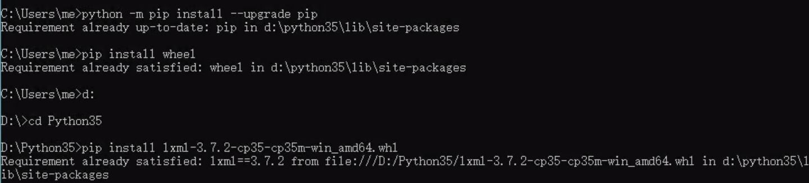
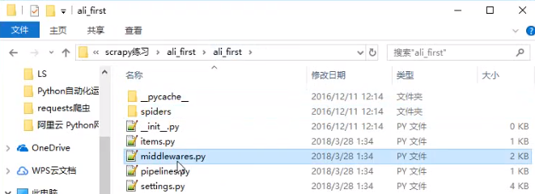
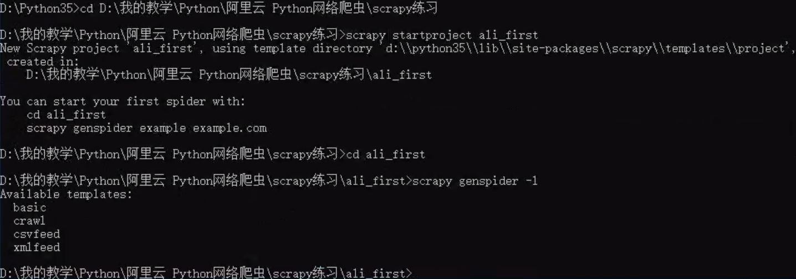
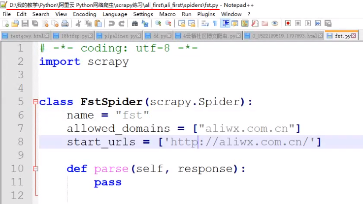
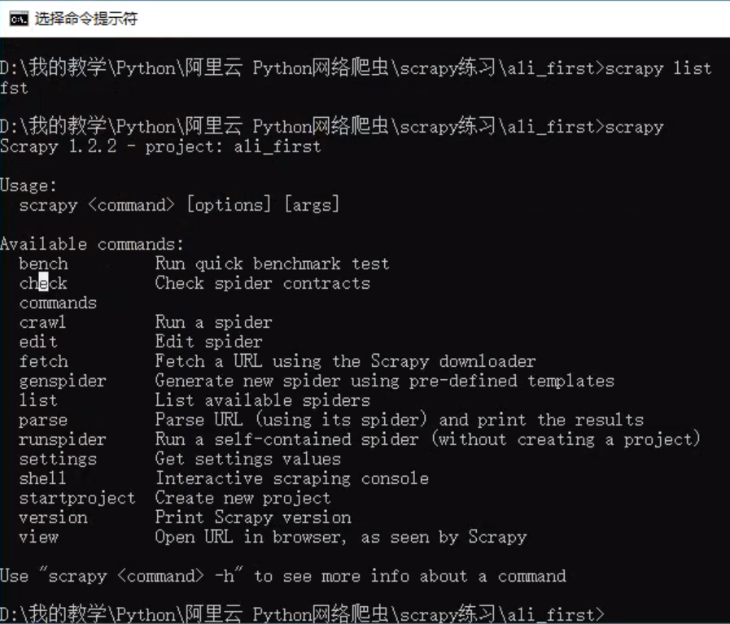

# 课时 5 Scrapy爬虫项目编写实战

课程地址：https://edu.aliyun.com/lesson_1994_17794#_17794

## Scrapy模块的安装

​	Scrapy模块是一个非常非常常用的爬虫框架模块，是哦用Scrapy可以快速创建爬虫项目。要使用Scrapy，首先需要安装。优点：方便，快速创建爬虫半成品项目

​	建议安装顺序：

1. ​	网络不好的朋友开个VPN（避免timeout方式之一）
2. ​	首先，升级pip（建议网络安装——直接命令行pip install）：python -m pip install --upgrade pip
3. ​	安装wheel（建议网络安装）
4. ​	安装 lxml （下载安装——先下载安装包whl文件，然后命令行进入所在文件夹，再pip+install+安装包全名，tab好像可以补全）例如：
5. ​	安装Twisted （下载安装）
6. ​	pip install scrapy （最新版本）或 pip install scrapy==1.1.0rc3 （指定版本）（建议网络安装）
7. ​	下载安装pywin32并配置（避免创建项目时出错，保证win32API），安装好之后找到python安装目录文件夹下模块文件夹lib下第三方模块文件夹site-package下pywin32_system32文件夹，内有两个dll动态链接文件（例如：pythoncom35.dll，pywintype35.dll，注意版本），确认（有系统权限时默认复制，以防万一）复制粘贴到C:\Windows\System32\下


推荐python包库：https://www.lfd.uci.edu/~gohlke/pythonlibs/

注意：

​	安装包名信息中cp34——python3.4版本，下载时需要与自己的python版本一致


## Scrapy常用指令实战

Scrapy一般通过命令行指令管理爬虫项目，常用指令有：

startproject 	**创建爬虫项目**

genspider -l 	**查看爬虫模板**

genspider -t 	模板 爬虫文件名 域名 **创建爬虫**

crawl 				**运行爬虫**

list					 **查看有哪些爬虫**


练习

项目命名以视频中的ali_first为例


先系统命令行进入准备存放项目的文件夹

\>d:

\>cd D:\\...\爬虫项目（存放项目的文件夹，=视频中的scrapy练习） 

### 1. 创建项目

```
scrapy startproject ali_first
```

（ali_first为自己命名的项目名称）



文件说明：

项目根目录下

scrapy.cfg：配置

爬虫项目/ali_first/ali_first/：同名文件夹，核心文件夹


/ali_first/下

\_\_init\_\_.py：初始化文件

items.py：定义目标，爬取信息——标题、内容等

spiders文件夹：存放多个爬虫文件

middlewares.py：中间件，中间处理

pipelines.py：爬后处理	（~~不是啪后处理...~~），比如将爬取到的信息写入数据库

settings.py：整个项目总体配置


### 2. 进入项目，查看模板

进入文件夹

```
cd ali_first
```

此时命令行前面为：D:\\...\爬虫项目\ali_first>


查看模板

```
scrapy genspider -l
```

basic		基础模板，常用

crawl		通用爬虫模板，快速建立

csvfeed	爬取csv格式数据，表格

xmlfeed	爬取xml格式数据




### 3. 创建爬虫

```
scrapy genspider -t basic fst aliwx.com.cn
```

参数： basic 模板；fst 爬虫文件命名；aliwx.com.cn 爬取目标网站域名

（注意：网站地址一般为主机名+域名，如www.baidu.com，www为主机名，后面为域名；如yq.aliyun.com，yq为主机名）

爬虫文件fst在\爬虫项目\ali_first\ali_first下




### 4. 运行爬虫

```
scrapy crawl fst
```


### 5. 查看当前项目下可用爬虫文件

```
scrapy list
```


详细了解其他指令

```
scrapy
```




## Scrapy爬虫项目编写基础

​	编写一个Scrapy爬虫项目，一般按照如下流程进行：

1. 创建爬虫项目
2. 编写items，定义爬取目标内容
3. 创建爬虫文件
4. 编写爬虫文件
5. 编写pipelines，爬后处理
6. 配置settings，全局配置


爬取目标：阿里文学首页书名

分析


## 使用Scrapy编写当当网商品数据爬虫实战


